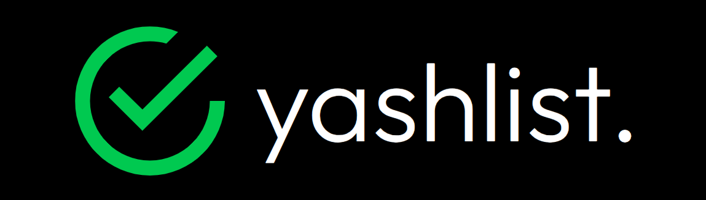
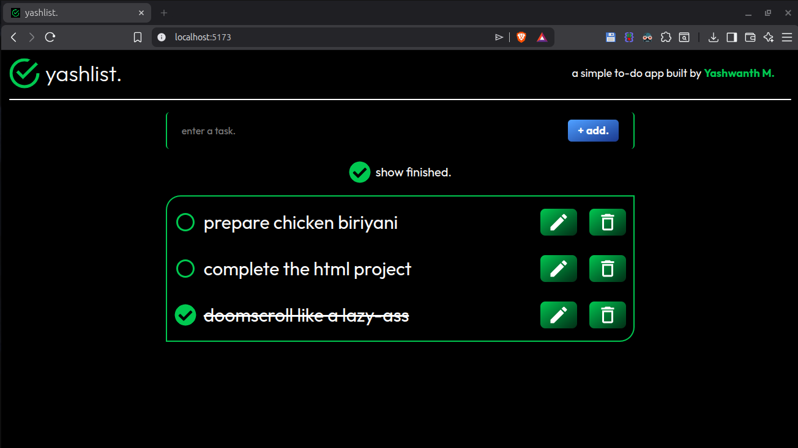
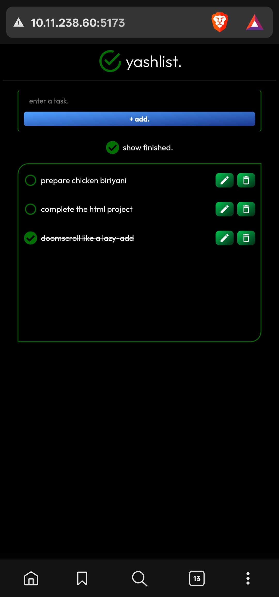

# **yashlist.** by YASHWANTH M



A clean, minimalistic-design todo app built with **React** and **Tailwind CSS**.<br>
**yashlist.** was a hands-on deep dive into React fundamentals like hooks, state management, conditional rendering, etc. all applied in one real, usable project.

The App is live now!
## [Check out `yashlist.` app](https://yashlist-todo-app.vercel.app/)

| Desktop | Mobile |
|--------|--------|
|  |  |

## Features

- **Add** new todos.
- **Edit** existing todos.
- **Delete** todos.
- **Show Finished Filter** - You can decide whether to see the finished ones or not.
- **localStorage** is used in this project, so your todos won't disappear after refresh or closing of the app.

## What I learned from this project

Working on this project gave me hands-on experience with:

- **`useState`** - managing todo list state, input state, filter toggle
- **`useEffect`** - syncing state to localStorage on every change
- **Conditional rendering** - showing/hiding todos based on the filter
- **List rendering** - mapping over todos with unique keys
- **Event handling** - `onChange`, `onClick` patterns
- **Controlled components** - keeping input fields in sync with state
- **Component thinking** - breaking UI into reusable pieces

## File Structure

```
yashlist.
├── node_modules/
│   └── This folder contains all the external packages/libraries the project needs to run.
│
├── public/
│   └── favicon.ico         // Appears in the browser tab next to the page title.
│
├── src/
│   ├── components/
│   │   └── This folder contains the React components used in the app.
│   │
│   ├── App.css
│   ├── App.jsx            // The main JSX file of the project.
│   ├── index.css
│   └── main.jsx
│
├── .gitignore             // Files and folders Git should ignore
├── app-logo.jpg           // The logo of the yashlist. app
├── eslint.config.js       // ESLint configuration for code linting rules
├── index.html             // The HTML file that React renders into
├── package-lock.json      // Exact versions of every installed package
├── package.json           // Project config, dependencies, and scripts
├── phone-preview.jpg      // Mobile preview of the app
├── preview.jpg            // Desktop preview of the app
├── README.md              // In-detail description of my project (You are reading this file now)
└── vite.config.js         // Vite bundler configuration
```

## Wanna run `yashlist.` locally? DO THIS.

```bash
# Clone the repository
git clone https://github.com/yash-2008-yash/yashlist-todo-app

# Navigate into the project
cd yashlist-todo-app

# Install dependencies
npm install

# Start the dev server
npm run dev
```

Then open `http://localhost:5173` in your browser.

## Contributing

Want to improve **yashlist.** or add new features? Feel free to:

1. **Fork the repository**

2. **Clone your fork:**

```bash
git clone https://github.com/yash-2008-yash/yashlist-todo-app
```

3. **Make your changes**

4. **Commit with a clear message:**

```bash
git commit -m "Add a meaningful description of your change"
```

5. **Push to your fork and open a Pull Request**

**Guidelines:**

- Stick to React + Tailwind CSS. No additional UI libraries.
- Keep commits small and meaningful.
- Make sure the app still works with localStorage after your changes.
- Keep the code readable.

## License

This project is licensed under the MIT License.

You are free to:

- Use the code
- Modify it
- Use it for learning or personal projects

## ⚠️ Disclaimer

**No copyright infringement intended.**<br>
`yashlist.` is only for educational and non-commercial purposes only.

---